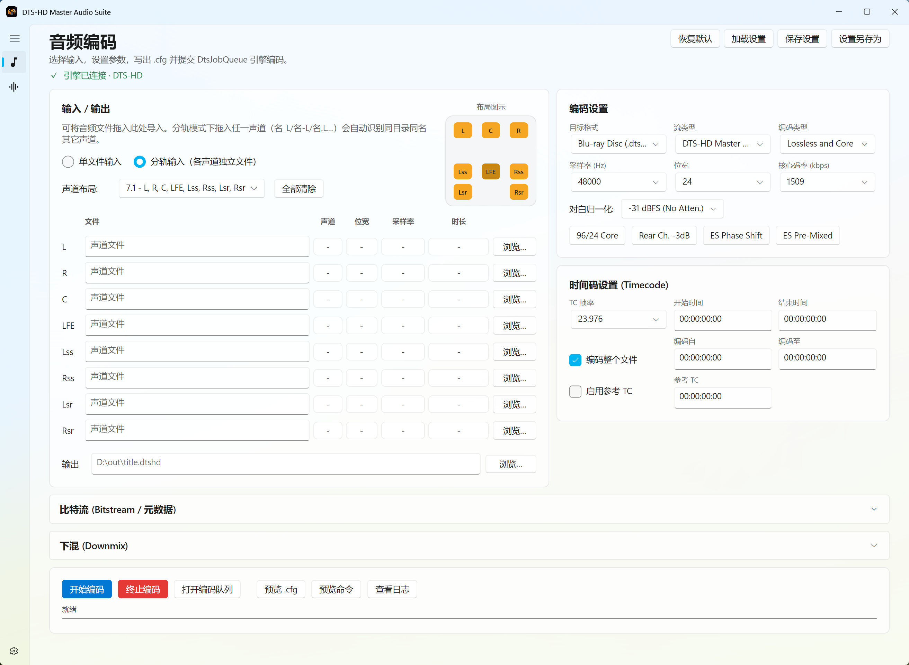
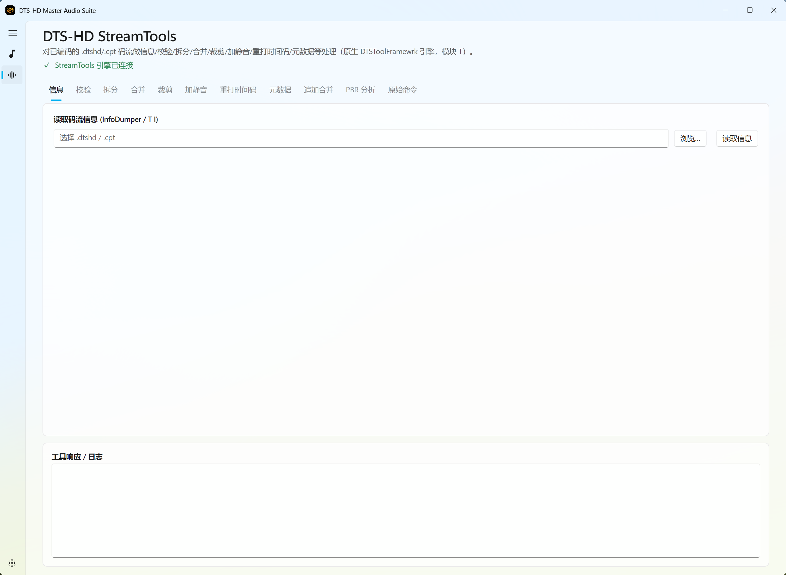

<div align="center">

# 🎬 DTS-HD.Encoder.Avalonia

**现代化的 DTS-HD Master Audio 编码图形前端**
*A modern GUI encoder front-end for DTS-HD Master Audio Suite*

[](LICENSE)
[](https://github.com/cgyihai/DTSHD.Encoder.Avalonia/releases)
[](https://dotnet.microsoft.com/)
[](https://avaloniaui.net/)
[](https://www.microsoft.com/windows)

🌐 [中文说明](#中文说明) · 🌍 [English](#english) · 📦 [下载 / Releases](https://github.com/cgyihai/DTSHD.Encoder.Avalonia/releases) · 📝 [更新日志 / Changelog](CHANGELOG.md)

</div>

---

## 中文说明

### 📖 项目简介

`DTS-HD.Encoder.Avalonia` 把命令行的 **DTS-HD Master Audio Suite** 编码引擎（`DtsJobQueue` / `DTSToolFramewrk`）封装成一个现代化、跨系统自适应的图形界面。它逆向复刻了官方 Java GUI（MAS-SAS 2.60.22）的完整编码逻辑，用 **Avalonia 12 + WinUIComposition GPU 合成管线** 重写界面，让「拖入音频 → 设参数 → 出 `.dtshd`」一步到位，同时保留官方 `.cfg` 的逐行一致性。

> 面向蓝光原盘制作、DTS-HD MA / DTS:X 音轨封装、码流后期处理的进阶用户。

### 🖼️ 界面预览

> 将截图放到 `docs/screenshots/` 后，把下面占位替换为实际图片即可。

| 音频编码 | DTS-HD StreamTools |
|:---:|:---:|
|  |  |

### ✨ 功能特性

#### 🎵 音频编码
- **双输入模式** — 单个多声道 WAV，或每声道独立的分轨 WAV
- **31 种声道布局** — 从 1.0 Mono 到 7.1 全变体（`Lss/Rss`、`Lw/Rw`、`Cs/Oh`、`Lhs/Rhs`、`Lh/Rh`、ES Matrix / ES Discrete…），布局与官方 `.cfg` 声道声明顺序完全一致
- **单文件自动声道重排** — 多声道 WAV 按 `dwChannelMask` 解析实际顺序，自动重排为 DTS 引擎期望顺序并去掉 channel mask，彻底解决 5.1/7.1 声道错位
- **分轨智能补齐** — 拖入任一声道（`名_L` / `名-L` / `名.L`…），自动识别同目录同名的其它声道并填入
- **拖放导入** — 文件拖入即按声道名智能归位，未识别的按顺序补齐
- **实时读取 WAV 头** — 自动显示声道数 / 位宽 / 采样率 / 时长，并按输入自动同步位宽与采样率

#### ⚙️ 编码参数
- **目标格式** — 蓝光 (BD) / BD 副音频 / DVD (.cpt) / DTS 音乐盘 (.wav) / Digital Delivery
- **流类型** — DTS-HD MA / DTS-HD High Res / DTS Digital Surround / DTS-ES / DTS 96/24 / DTS-HD LBR (Express)
- **编码类型** — 无损+核心 / 仅无损 / 仅核心 / LBR
- **采样率 / 位宽 / 核心码率 / 对白归一化 (DialNorm)** 一应俱全
- **时间码** — TC 帧率、起止时间码、编码区段、参考 TC，可按最长输入时长自动填充结束时间码

#### 🎚️ 比特流 / 元数据
- **主音频衰减**（Static，含 Fade Down / Fade Up）
- **单声道次音频声道输出映射**（L/R/C/Ls/Rs 的 dB 推子）
- **AAF 元数据嵌入** — Unison / Independent 衰减，六声道衰减值 + 声像 (Panning)
- **无缝分支** — 单一剪辑 / CSV 分支点
- **Express 对话模式**、**7.1 Wide 重映射**、**程序信息 (Program Info)**

#### 🎛️ 下混 (Downmix)
- **下混到 5.1** — 6.1/7.1 → 5.1 矩阵，随布局自动套用官方 `downmix51.properties` 默认系数，支持保留当前声道 / Legacy Matrix
- **下混到 2.0** — Lo/Ro 与 Lt/Rt，饱和检测、嵌入下混
- 每个下混系数都是可视化 dB 推子，附刻度尺

#### 📝 队列、预览与设置档
- **多任务编码队列**（独立弹窗，关闭不影响后台编码）
- **实时进度** — 引擎帧进度 → 输出文件大小估算 → 已用时间估算，三级回退保证进度条不卡死；含耗时 / 剩余 / MB / 饱和警告 / MD5
- **预览** — 一键预览生成的 `.cfg` 与提交给引擎的命令行；实时查看诊断日志
- **设置档** — 编码参数保存 / 加载 / 另存为（JSON）
- **编码前校验** — 输入位宽/采样率一致性、AAF/96-24 冲突、目标卷磁盘空间预检

#### 🔧 DTS-HD StreamTools（码流后期）
对已编码的 `.dtshd` / `.cpt` 码流做 11 类处理（原生 `DTSToolFramewrk` 引擎，端口 4442）：

`信息` · `校验` · `拆分` · `合并` · `裁剪` · `加静音` · `重打时间码` · `元数据` · `追加合并` · `PBR 峰值码率分析（带折线图）` · `原始命令`

#### 🖥️ 体验与稳定性
- **分辨率 / DPI 自适应** — 按显示器缩放正确换算窗口尺寸，1080p / 高分屏 / 缩放屏均不再过大或超出屏幕
- **刷新率自适应** — 跟随显示器 vsync（144Hz 显示器即 144fps，不锁 60）
- **矢量图标** — 导航图标内嵌矢量路径，任何系统（含精简版 Win10 / Server）都不会出现图标空白
- **实时双语切换** — 简体中文 / 英文，设置页一键切换、免重启即时生效
- **主题** — 跟随系统 / 浅色 / 深色；Windows 11 Mica 云母背景
- **GitHub 在线更新** — 「关于」页一键检查新版本并跳转下载
- **引擎自适应** — 自动定位 `DTS-HD_Tool`、按需拉起/复用原生引擎、断线自动重连

### 🧱 技术栈

| 组件 | 版本 | 说明 |
|---|---|---|
| .NET | 10.0 | 目标框架 |
| Avalonia | 12.0.3 | 跨平台 UI 框架 |
| CommunityToolkit.Mvvm | 8.4.0 | MVVM + 源生成器 |
| Avalonia-Fluent-UI | 2.0.0 | Fluent 控件（NavigationView / AppWindow / Mica…） |
| 渲染 | ANGLE EGL (DX11) + WinUIComposition / DirectComposition | GPU 硬件合成 |

架构：**MVVM + 编译时绑定**，业务逻辑与 UI 平台解耦（ViewModel 通过委托注入文件对话框等平台服务）。

### ⚠️ 法律声明（重要）

本仓库 **不包含** 也 **不会分发** 任何 DTS, Inc. 的专有工具链，包括但不限于：

- `dtshd.exe` / `dtshdst.exe` / `DTSHDVerify.exe`
- `DTSToolFramewrk.exe` / `DtsJobQueue.exe`
- `MAS-SAS_Authorizer.exe` / `InfoDumper.exe`
- `AAFCOAPI.dll` / `aafParse.dll` / `DTSEncConfig.dll` / `DTSWin32.dll`

**用户需自行合法获取 DTS-HD Master Audio Suite 工具链**，并放置于主程序同级的 `DTS-HD_Tool/` 目录下。本仓库仅提供 GUI 封装代码，不含任何 DTS 专有算法或二进制文件。

`DTS`、`DTS-HD`、`DTS-HD Master Audio`、`MAS-SAS` 等均为 **DTS, Inc.** 的注册商标，本项目与 DTS, Inc. 无任何关联。

### 🚀 快速开始

1. 到 [Releases](https://github.com/cgyihai/DTSHD.Encoder.Avalonia/releases) 下载最新版并解压
2. 将合法获取的 `DTS-HD_Tool/` 工具链目录放到主程序 `.exe` 同级
3. 运行 `DTS-HD.Encoder.Avalonia.exe`，进入「设置」确认工具集状态显示绿色 ✓
4. 回到「音频编码」，拖入音频 → 设参数 → 指定输出 → 开始编码

目录结构示意：

```
DTS-HD.Encoder.Avalonia.exe
DTS-HD_Tool/              ← 用户自备的官方工具链
├─ DtsJobQueue.exe
├─ DTSEncConfig.dll
├─ conf/                  ← 下混/显示默认配置
└─ ...
EncoderProfiles/          ← 编码设置档（自动生成）
```

### 🛠️ 从源码构建

1. 安装 **.NET 10 SDK**
2. 克隆并编译
   ```bash
   git clone https://github.com/cgyihai/DTSHD.Encoder.Avalonia.git
   cd DTSHD.Encoder.Avalonia
   dotnet restore
   dotnet build -c Release
   ```
3. （可选）将 DTS 工具链放到输出目录的 `DTS-HD_Tool/` 下
4. 运行
   ```bash
   dotnet run --project DTS-HD.Encoder.Avalonia -c Release
   ```

### 🙏 致谢

- [Avalonia](https://avaloniaui.net/) — MIT License
- [Avalonia-Fluent-UI](https://github.com/HiyorinI/AvaloniaFluentUI) — MIT License
- [CommunityToolkit.Mvvm](https://github.com/CommunityToolkit/Mvvm) — MIT License

### 📄 许可证

本项目基于 [MIT License](LICENSE) 开源。作者：**cgyihai / linmeng**。

---

## English

### 📖 Overview

`DTS-HD.Encoder.Avalonia` wraps the command-line **DTS-HD Master Audio Suite** encoding engine (`DtsJobQueue` / `DTSToolFramewrk`) in a modern, DPI-adaptive GUI. It faithfully reverse-engineers the full encoding logic of the official Java GUI (MAS-SAS 2.60.22) and rebuilds the interface on **Avalonia 12 + the WinUIComposition GPU pipeline**, turning "drag in audio → set parameters → get `.dtshd`" into a one-stop flow while keeping line-for-line fidelity with the official `.cfg`.

> Aimed at advanced users doing Blu-ray authoring, DTS-HD MA / DTS:X track muxing, and bitstream post-processing.

### 🖼️ Screenshots

> Drop your images into `docs/screenshots/` and replace the placeholders below.

| Audio Encode | DTS-HD StreamTools |
|:---:|:---:|
|  |  |

### ✨ Features

#### 🎵 Encoding
- **Dual input modes** — a single multichannel WAV, or one WAV per channel (split tracks)
- **31 channel layouts** — 1.0 Mono to every 7.1 variant (`Lss/Rss`, `Lw/Rw`, `Cs/Oh`, `Lhs/Rhs`, `Lh/Rh`, ES Matrix / ES Discrete…), matching the official `.cfg` channel-declaration order exactly
- **Automatic channel remap for single-file WAV** — parses the real order from `dwChannelMask`, reorders interleaving to what the DTS engine expects and strips the mask, eliminating 5.1/7.1 channel misalignment
- **Smart sibling detection** — pick one channel (`name_L` / `name-L` / `name.L`…) and matching channels in the same folder are auto-filled
- **Drag & drop import** with per-channel routing by filename
- **Live WAV header read** — channels / bit-depth / sample rate / duration, auto-syncing bit-width & sample rate to the input

#### ⚙️ Encode Parameters
- **Target formats** — Blu-ray (BD) / BD Secondary / DVD (.cpt) / DTS Music Disc (.wav) / Digital Delivery
- **Stream types** — DTS-HD MA / High Res / DTS Digital Surround / DTS-ES / DTS 96/24 / DTS-HD LBR (Express)
- **Encode types** — Lossless + Core / Lossless Only / Core Only / LBR
- **Sample rate / bit-width / core bitrate / dialog normalization**
- **Timecode** — frame rate, start/end, encode range, reference TC, with auto-fill from the longest input

#### 🎚️ Bitstream / Metadata
- Primary audio attenuation (Static, with Fade Down / Up)
- Mono secondary-audio channel-output mapping (per-channel dB faders)
- AAF metadata embedding — Unison / Independent attenuation, six-channel values + Panning
- Seamless branching — Single Clip / CSV branch points
- Express dialog mode, 7.1 Wide remapping, Program Info

#### 🎛️ Downmix
- **To 5.1** — 6.1/7.1 → 5.1 matrix with official per-layout defaults from `downmix51.properties`, keep-current-channels / Legacy Matrix
- **To 2.0** — Lo/Ro and Lt/Rt, saturation check, embedded downmix
- Every coefficient is a visual dB fader with a scale

#### 📝 Queue, Preview & Profiles
- Multi-job encode queue (separate window; closing it doesn't stop encoding)
- Real-time progress with a three-tier fallback (engine frame % → output size → elapsed time), plus elapsed / ETA / MB / saturation warnings / MD5
- Preview the generated `.cfg` and the engine command line; live diagnostic log
- Save / load / save-as encode profiles (JSON)
- Pre-encode validation — bit-width & sample-rate consistency, AAF/96-24 conflicts, target-drive free-space check

#### 🔧 DTS-HD StreamTools
11 operations on encoded `.dtshd` / `.cpt` bitstreams (native `DTSToolFramewrk` engine):

`Info` · `Verify` · `Split` · `Join` · `Trim` · `Add Silence` · `Restripe` · `Metadata` · `Append` · `PBR analysis (with graph)` · `Raw command`

#### 🖥️ Experience & Stability
- **Resolution / DPI adaptive** window sizing (no more oversized windows on 1080p or scaled displays)
- **Refresh-rate adaptive** rendering (follows display vsync)
- **Vector icons** — never blank, even on stripped Windows 10 / Server
- **Real-time bilingual UI** — Simplified Chinese / English, switch from Settings with no restart
- Theme (system / light / dark); Windows 11 Mica backdrop
- **GitHub online update** check from the About page
- Engine auto-discovery, on-demand launch/reuse, auto-reconnect

### 🧱 Tech Stack

| Component | Version |
|---|---|
| .NET | 10.0 |
| Avalonia | 12.0.3 |
| CommunityToolkit.Mvvm | 8.4.0 |
| Avalonia-Fluent-UI | 2.0.0 |

Architecture: **MVVM with compiled bindings**, UI-platform-decoupled ViewModels.

### ⚠️ Legal Notice (Important)

This repository **does not contain** and **will not distribute** any proprietary DTS, Inc. toolchain, including but not limited to:

- `dtshd.exe` / `dtshdst.exe` / `DTSHDVerify.exe`
- `DTSToolFramewrk.exe` / `DtsJobQueue.exe`
- `MAS-SAS_Authorizer.exe` / `InfoDumper.exe`
- `AAFCOAPI.dll` / `aafParse.dll` / `DTSEncConfig.dll` / `DTSWin32.dll`

**Users must legally obtain the DTS-HD Master Audio Suite toolchain** and place it in the `DTS-HD_Tool/` directory next to the executable. This repository provides GUI wrapper code only and contains no DTS proprietary algorithms or binaries.

`DTS`, `DTS-HD`, `DTS-HD Master Audio`, `MAS-SAS` are registered trademarks of **DTS, Inc.** This project is not affiliated with DTS, Inc. in any way.

### 🚀 Quick Start

1. Download the latest build from [Releases](https://github.com/cgyihai/DTSHD.Encoder.Avalonia/releases)
2. Put your legally-obtained `DTS-HD_Tool/` next to the `.exe`
3. Run it, open **Settings**, confirm the toolset shows a green ✓
4. Back on **Encode**, drag in audio → set parameters → choose output → start

### 🛠️ Build from Source

1. Install **.NET 10 SDK**
2. Clone & build
   ```bash
   git clone https://github.com/cgyihai/DTSHD.Encoder.Avalonia.git
   cd DTSHD.Encoder.Avalonia
   dotnet restore
   dotnet build -c Release
   ```
3. (Optional) place the DTS toolchain under `DTS-HD_Tool/` in the output directory
4. Run
   ```bash
   dotnet run --project DTS-HD.Encoder.Avalonia -c Release
   ```

### 🙏 Acknowledgements

- [Avalonia](https://avaloniaui.net/) — MIT License
- [Avalonia-Fluent-UI](https://github.com/HiyorinI/AvaloniaFluentUI) — MIT License
- [CommunityToolkit.Mvvm](https://github.com/CommunityToolkit/Mvvm) — MIT License

### 📄 License

Licensed under the [MIT License](LICENSE). Authors: **cgyihai / linmeng**.
